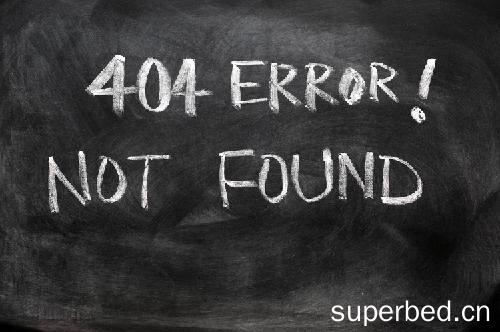

# 丘成桐数学思想与人生智慧

**——以数学老师的人格魅力为核心**

## 人物简介

丘成桐（Shing-Tung Yau，1949年生），世界著名数学家，菲尔兹奖得主，美国哈佛大学教授，清华大学讲席教授。

### 核心成就
- 1977年证明了**卡拉比猜想**，奠定卡拉比-丘流形理论基础
- 1982年获**菲尔兹奖**，被称为"数学界的诺贝尔奖"
- 2010年获**沃尔夫数学奖**
- 发表学术论文**300余篇**

---

## 学术贡献

### 卡拉比-丘流形
卡拉比-丘流形是微分几何中最重要概念之一，在弦理论中具有核心地位——弦理论预言的额外六维空间被认为隐藏于此。

### 主要研究领域
- 微分几何
- 代数几何  
- 非线性分析
- 数学物理

---

## 求学经历（人格魅力体现）

### 艰难求学路
- **1949年**：出生于广东汕头，后移居香港
- **1969年**：香港中文大学毕业（提前一年）
- **1971年**：加州大学伯克利分校博士（师从陈省身）

**人格魅力**：在贫寒中坚持求学，展现了对数学的纯粹热爱。

### 恩师陈省身
陈省身是丘成桐的导师，对他的学术生涯影响深远。丘成桐常说："陈老师教会我如何做数学，更教会我如何做人。"

---

## 数学观——做数学的根本

### 什么是真正的数学？

丘成桐认为，数学不仅是计算和公式，更是一种**追求真理的艺术**。

**核心观点：**

1. **数学是真与美的统一**
   > "数学是美的，美的数学需要用真心去体会。"
   > 数学的真在于其逻辑的严密性，数学的美在于其结构的和谐性。

2. **数学是人类智慧的结晶**
   > 数学是人类理解自然、探索宇宙的工具。每一次数学突破都推动人类对世界的认知。

3. **数学的原创性**
   > 真正的数学家不是跟着别人的脚步走，而是开辟新的领域、提出新的问题。

4. **数学与物理的融合**
   > "物理为我提供了问题的方向，几何为我提供了解决问题的方法。"

---

## 学习方法——如何学好数学

### 丘成桐的数学学习之道

#### 一、打好基础："根深才能叶茂"

**核心要点：**
- **重视基础训练**：从中学开始就要扎扎实实学好每一块内容
- **不要急功近利**：基础不牢，地动山摇
- **循序渐进**：没有捷径可走，必须一步步来

**具体方法：**
1. **精读经典教材**：选择1-2本权威教材，逐字逐句研读
2. **独立完成习题**：不看不答案，自己思考推导
3. **温故知新**：定期复习已学内容，建立知识网络

> "我见过太多天才，因为基础不牢而泯然众人。"

#### 二、学会思考："思而不学则殆，学而不思则罔"

**独立思考的重要性：**
- 不要死记硬背公式，要理解公式背后的逻辑
- 遇到问题先自己思考，实在想不通再请教他人
- **敢于挑战难题**：即使失败也是宝贵的经验

**思考的习惯：**
1. **问"为什么"**：每个结论都要追问原因
2. **多想几种解法**：一道题用不同方法解答
3. **举一反三**：把一个问题的解法推广到类似问题

> "数学不是记忆的比赛，是思考的较量。"

#### 三、广泛阅读："博观而约取"

**推荐阅读策略：**
- **经典原著**：读伟人的原始论文和著作
- **跨领域学习**：了解数学各分支的联系
- **关注前沿**：跟踪最新研究动态

**丘成桐的阅读习惯：**
> 年轻时广泛阅读了几何、分析、代数等多个领域的书籍，为后来的突破打下坚实基础。

#### 四、勤于实践："纸上得来终觉浅"

**实践方法：**
1. **大量做题**：数学是"做"出来的，不是"看"出来的
2. **独立研究**：尝试解决未知的数学问题
3. **参加竞赛**：锻炼思维能力和抗压能力

---

## 数学素养培养

### 什么是数学素养？

数学素养是一个人理解数学、运用数学思维解决问题的综合能力。

#### 一、逻辑思维能力

**核心要素：**
- **抽象思维**：从具体事物中抽取本质属性
- **推理能力**：从已知推导未知
- **证明能力**：用严谨的逻辑说服他人

**培养方法：**
1. 学习形式逻辑的基本规则
2. 练习证明题的书写规范
3. 学会区分"证明"和"举例否定"

#### 二、空间想象能力

**丘成桐的强项**：正是出色的空间想象能力帮助他证明了卡拉比猜想。

**训练方法：**
1. 多接触几何图形，在脑海中"可视化"
2. 尝试用几何直觉指导代数推导
3. 跨领域联想：音乐、美术中的空间感

#### 三、问题转化能力

**定义**：将复杂问题简化为已知类型的问题。

**培养途径：**
1. 学习多种数学工具和方法
2. 善于类比：把新问题转化为熟悉的问题
3. 保持开放心态：问题往往有多种解法

#### 四、数学审美能力

**核心观点**：
> "一个好的数学家，不仅要会做题，还要能欣赏数学的美。"

**美的标准：**
- **简洁性**：用最简单的工具解决问题
- **对称性**：结构的对称带来美感
- **意外性**：意想不到的联系令人惊喜

**如何培养：**
1. 多接触优美的数学定理
2. 体会证明的"自然"与"巧妙"
3. 学会判断什么是"好"的数学

---

## 治学精神

### 做大学问的品格

#### 一、热爱与执着

**核心观点**：
> "做学问要真心喜欢，不是为名利。真正的大师是因为热爱而坚持。"

**热爱的表现：**
- 愿意为解决一个问题废寝忘食
- 把研究当作乐趣而不是负担
- 即使遇到挫折也不放弃

#### 二、勇气与坚持

**敢于挑战：**
- 不怕权威，敢于挑战未解决的难题
- 不怕失败，把失败当作通向成功的必经之路
- 不怕批评，真理越辩越明

**丘成桐的突破精神：**
> 1977年证明卡拉比猜想时，他顶着巨大压力，坚持自己的数学直觉。

#### 三、严谨与诚信

**学术规范：**
- 数据要真实，引用要规范
- 不夸大成果，不隐瞒缺陷
- 对错误要有勇气承认和修正

> "数学是追求真理的殿堂，容不得半点虚假。"

#### 四、视野与胸怀

**开阔视野：**
- 不仅要懂自己的专业，还要了解相关领域
- 与不同背景的学者交流合作
- 关注数学以外的世界

**宽广胸怀：**
- 愿意分享知识，不保守
- 提携后辈，薪火相传
- 超越个人得失，追求更高目标

---

## 教育理念

### 核心观点

**1. 学问要"真"**
> 做学问要真心喜欢，不是为名利。真正的大师是因为热爱而坚持。

**2. 基础教育的重要性**
> 基础不牢，地动山摇。数学教育要注重基础训练，不能急功近利。

**3. 独立思考**
> 不要迷信权威，要敢于挑战难题，即使失败也是宝贵的经验。

**4. 勤奋与天赋**
> 天赋决定上限，勤奋决定能否达到上限。天才+勤奋=大师。

### 名言精选
- "数学是美的，美的数学需要用真心去体会。"
- "做研究不是为了获奖，是为了探索真理。"
- "年轻人要敢想敢做，不要被已有的框架束缚。"
- "我不怕得罪人，我只怕误人子弟。"

---

## 为人处世

### 刚正不阿
丘成桐以直言著称，曾多次公开批评中国学术界的不良风气。

### 提携后辈
- 创立**丘成桐中学数学奖**（2007年）
- 创立**丘成桐大学生数学竞赛**（2010年）
- 大力支持年轻学者赴美深造

### 赤子之心
虽然长期在国外，但始终心系中国数学发展，在清华大学建立丘成桐数学科学中心。

---

## 对中国数学的贡献与批评

### 贡献
1. 推动清华大学数学系重建
2. 创办各类数学竞赛选拔人才
3. 引介国际前沿数学研究

### 批评（人格魅力的另一面——敢于说真话）
- 批评国内"唯论文"导向
- 指出中国数学与世界先进水平的差距
- 呼吁重视原创性研究

---

## 数学学习阶段指南

### 中学阶段（打基础）
- **重点**：培养兴趣，打好代数和几何基础
- **方法**：多做习题，精读教材，建立错题本
- **目标**：对数学产生兴趣，学会独立思考

### 大学阶段（成体系）
- **重点**：建立完整的数学知识体系
- **方法**：广泛阅读，接触前沿，开始尝试研究
- **目标**：找到自己的兴趣方向，掌握研究方法

### 研究生阶段（出成果）
- **重点**：在某一领域做出原创性贡献
- **方法**：紧跟导师，大量阅读，独立思考
- **目标**：发表有价值的论文，成为独立研究者

---

## 相关资源

### 著作
- 《我的教育观》— 丘成桐谈求学与做人
- 《丘成桐与数学》
- Various academic papers on Calabi-Yau manifolds

### 数学知识参考

**卡拉比猜想**：1954年提出，1977年由丘成桐证明。猜想认为存在一类没有复结构变形的紧致复流形。

**应用领域**：
- 弦理论（额外维度）
- 代数几何
- 理论物理

---

## 总结

### 人格魅力
丘成桐的人格魅力体现在：
1. **学术诚信** — 追求真理，不慕名利
2. **直言不讳** — 敢于批评，勇于担当
3. **薪火相传** — 提携后学，桃李天下
4. **赤子之心** — 心系故国，无私奉献

### 核心理念

| 维度 | 核心内容 |
|------|----------|
| **数学观** | 数学是真与美的统一，追求真理的艺术 |
| **学习方法** | 打好基础、独立思考、广泛阅读、勤于实践 |
| **素养培养** | 逻辑思维、空间想象、问题转化、数学审美 |
| **治学精神** | 热爱执着、勇气坚持、严谨诚信、视野胸怀 |

> "数学是我的生命，教育是我的使命。"
> — 丘成桐
